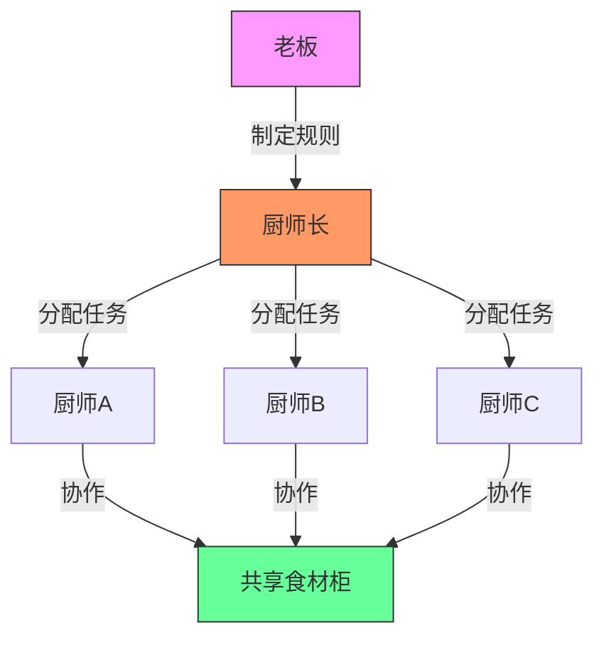
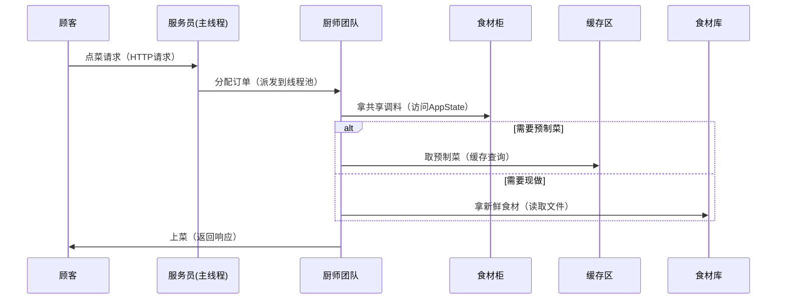
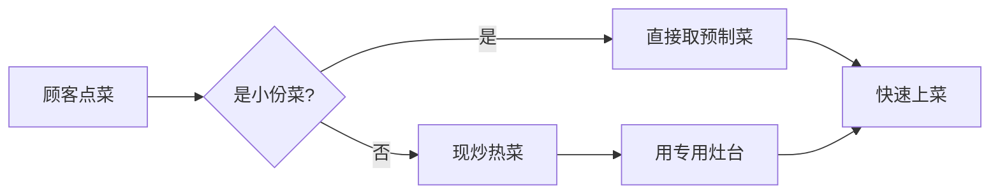

> 你来根据源码，解读这个程序的多线程设计（用户不懂多线程，由浅入深教给他，最好配合Mermaid）：{源码}

我将用「厨师团队」的比喻来讲解这个程序的多线程设计，配合流程图帮助理解：

---
### **多线程设计解析 (厨师团队模型)** 🔧

#### **1. 整体架构图**


#### **2. 关键角色对应表**
| 程序组件            | 厨师团队比喻          | 作用说明                     |
|---------------------|---------------------|----------------------------|
| `tokio运行时`        | 厨师长               | 管理所有厨师(线程)的工作分配 |
| `64并发限制`         | 最多同时做6道菜       | 防止厨房拥挤                |
| `AppState`           | 共享食材柜           | 存放公共调料和工具          |
| `缓存系统`           | 预制菜存放区         | 快速提供常见菜品            |
| `文件流处理`         | 流水线配菜流程       | 高效处理大批量食材          |

---

### **3. 核心流程解析** 🧑🍳
#### **3.1 请求处理流程**


#### **3.2 线程协作示例**
```rust
// 共享的食材柜设计（线程安全）
struct AppState {
    root_dir: Arc<PathBuf>,   // 共享的菜谱目录（只读）
    cache: Cache<String, Vec<u8>>, // 预制菜存放区（带锁的冰箱）
}

// 厨师工作流程（线程任务）
async fn serve_file(/*...*/) -> Response {
    // ✅ 安全访问共享数据（通过原子引用计数）
    let path = state.root_dir.join(&path); 
  
    // ✅ 并发控制（最多64个厨师同时工作）
    // 通过ConcurrencyLimitLayer实现
  
    // ✅ 缓存读取（线程安全的哈希表）
    if let Some(cached) = state.cache.get(&path).await {
        return cached;
    }
  
    // ✅ 文件流处理（非阻塞IO）
    let file = File::open(path).await?; // 不阻塞其他厨师
}
```

---

### **4. 关键技术点** 🔑

#### **4.1 线程安全设计**
| 技术手段          | 厨师团队类比                  | 代码示例                     |
|------------------|-----------------------------|----------------------------|
| `Arc<T>`         | 公共菜谱(多人只读)           | `root_dir: Arc<PathBuf>`   |
| `Cache`          | 带锁的冰箱                   | `cache: Cache<...>`        |
| `tokio::spawn`   | 自动分配空闲厨师              | axum自动处理                |
| `async/await`    | 非阻塞工作模式                | `File::open(...).await`    |

#### **4.2 性能优化点**


对应代码实现：
```rust
// 小文件缓存优化（MAX_CACHE_FILE_SIZE = 1MB）
if file_size <= MAX_CACHE_FILE_SIZE {
    cache.insert(cache_key, buffer.clone()).await; // 做好预制菜
    return buffer; // 快速上菜
}

// 大文件流式传输（不阻塞厨房）
let reader_stream = ReaderStream::with_capacity(file, 8*1024); // 专用传送带
```

---

### **5. 新手常见疑问解答** ❓
**Q：为什么不用更多线程？**
```markdown
A：就像厨房不是越大越好：
   - 64线程限制防止资源争抢（太多厨师会挤在一起）
   - 每个线程都能高效处理多个任务（一个厨师可以同时看管多个锅）
   - I/O密集型任务更适合异步处理（等水开时可以切菜）
```

**Q：共享数据如何保证安全？**
```markdown
A：通过三大安全措施：
   1. 原子引用计数（Arc）-> 确保菜谱不被提前收走
   2. 互斥锁（Cache内部）-> 保证只有一个厨师操作冰箱
   3. 只读共享（PathBuf）-> 公共菜谱只读不修改
```

**Q：如何查看线程工作情况？**
```rust
// 在main函数添加tokio-console支持
#[tokio::main(flavor = "multi_thread", worker_threads = 4)]
async fn main() {
    console_subscriber::init(); // 添加这行
    // ...
}
```
运行命令：`tokio-console` 可以看到实时线程状态（类似厨房监控系统）

---

通过这个设计，程序就像一个高效运转的厨房：
- 主线程（服务员）快速接待客人
- 线程池（厨师团队）并行处理请求
- 共享数据（食材柜）安全协作
- 缓存系统（预制菜）提升响应速度
- 流式处理（传送带）优化大文件传输

这种设计在保证安全的前提下，能同时服务大量用户，就像米其林厨房高效出餐！ 🍳🚀