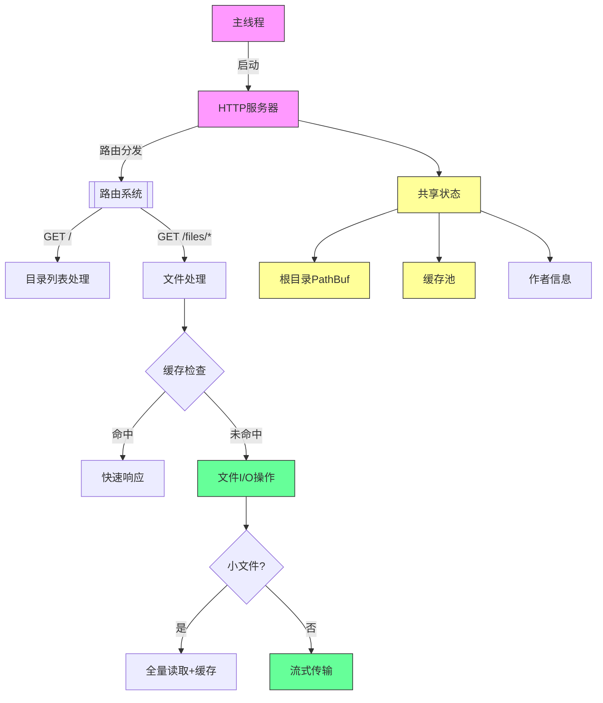
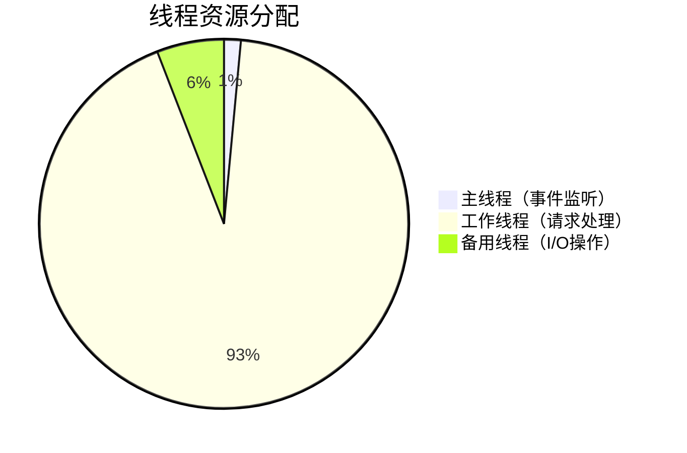
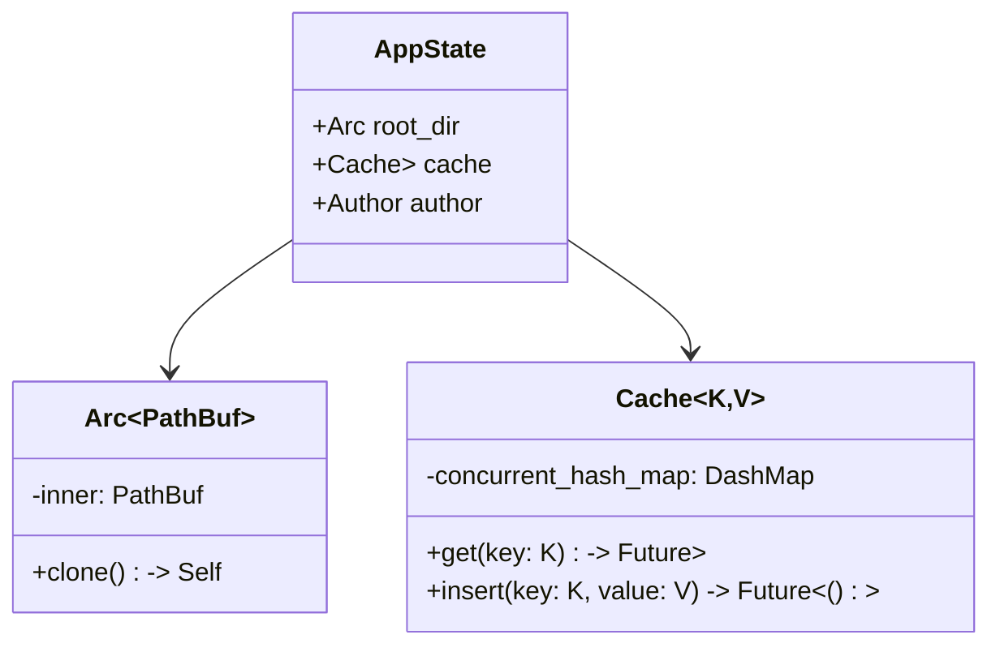
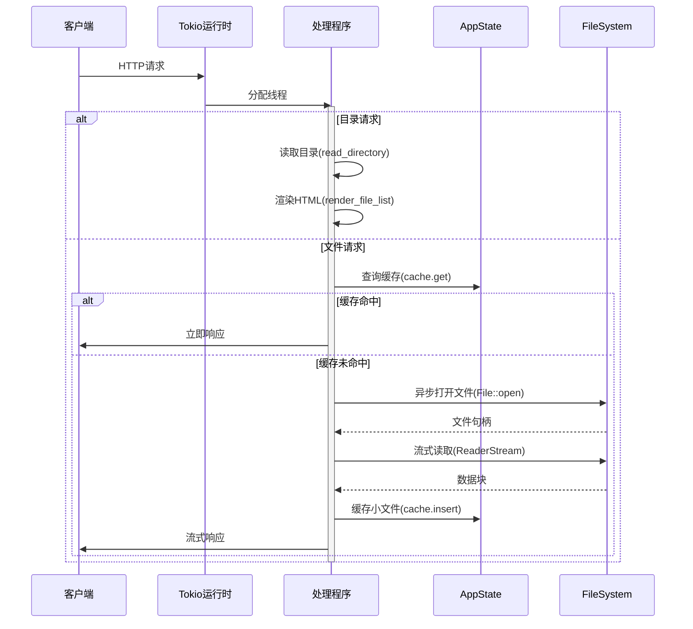
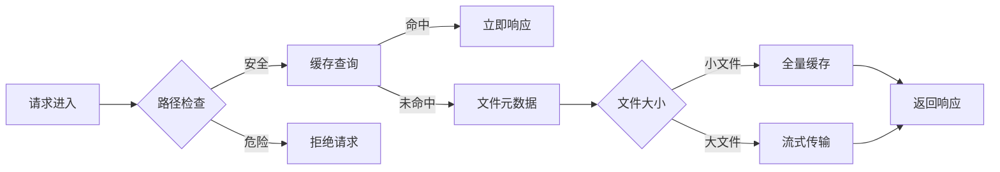
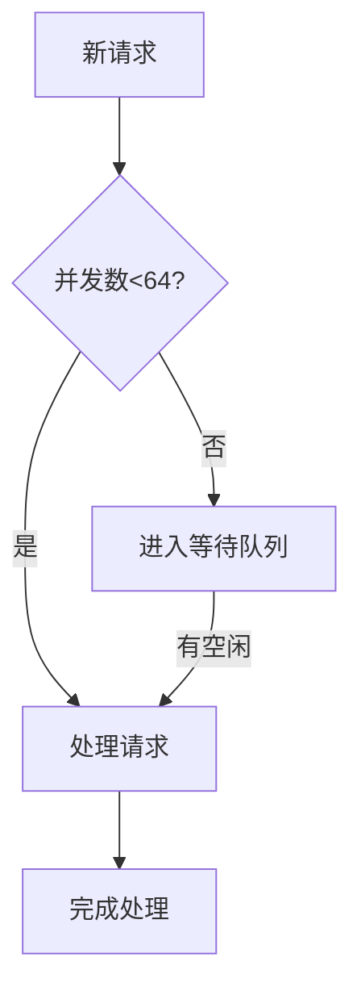
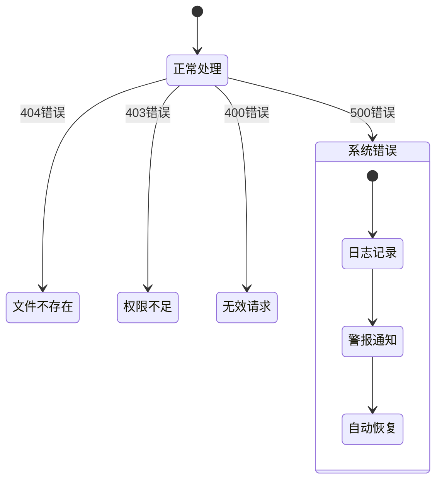

> 最后应该回归到提供的程序 ，你来绘制图表和解释 {源码}

我将通过架构图和关键代码段的对应关系，详细解析这个文件分享程序的多线程设计：

---
### **程序架构图解** 🔍



---

### **多线程设计要素解析** 🧩

#### **1. 异步运行时架构**
```rust
#[tokio::main]  // 核心线程池启动
async fn main() -> Result<()> {
    let app = Router::new()
        .layer(ConcurrencyLimitLayer::new(64)) // 并发控制
        .with_state(shared_state); // 共享数据
  
    axum::serve(listener, app).await?; // 请求监听循环
}
```



#### **2. 共享状态设计**
```rust
#[derive(Clone)]
struct AppState {
    root_dir: Arc<PathBuf>,    // 原子引用计数只读路径
    cache: Cache<String, Vec<u8>>, // 线程安全缓存
    author: Author,            // 克隆安全结构体
}
```


#### **3. 请求处理流程**


#### **4. 关键技术点对照表**
| 代码片段 | 技术实现 | 多线程意义 |
|---------|---------|-----------|
| `Arc<PathBuf>` | 原子引用计数 | 多线程安全共享只读路径 |
| `Cache<String, Vec<u8>>` | 并发哈希表 | 线程安全缓存访问 |
| `ConcurrencyLimitLayer(64)` | 信号量限制 | 防止线程资源耗尽 |
| `ReaderStream::with_capacity` | 异步流处理 | 非阻塞I/O操作 |
| `tokio::fs::File` | 异步文件API | 不阻塞线程池 |

---

### **性能关键路径分析** ⚡
```rust
async fn serve_file(/*...*/) -> Response {
    // 阶段1：安全检查（无锁操作）
    if path.contains("..") { return forbidden(); }

    // 阶段2：缓存读取（并发安全访问）
    if let Some(data) = state.cache.get(&path).await {
        return cached_response(data);
    }

    // 阶段3：文件处理
    let metadata = fs::metadata(path).await?; // 异步I/O
  
    // 阶段4：动态策略选择
    if metadata.len() <= MAX_CACHE_FILE_SIZE {
        // 小文件路径：同步缓存
        let buffer = file.read_to_end().await?;
        cache.insert(path, buffer.clone()).await; // 异步写入
        return full_response(buffer);
    } else {
        // 大文件路径：流式传输
        let stream = ReaderStream::with_capacity(file, 8_192); // 8KB缓冲
        return stream_response(stream);
    }
}
```


---

### **并发控制机制** 🔒
#### **1. 显式控制层**
```rust
.layer(ConcurrencyLimitLayer::new(64)) // 关键代码
```


#### **2. 隐式控制机制**
| 机制 | 代码示例 | 作用 |
|------|---------|-----|
| 异步I/O | `tokio::fs::File::open` | 释放线程资源 |
| 缓冲流 | `ReaderStream::with_capacity` | 控制内存占用 |
| 原子操作 | `Arc` 引用计数 | 无锁共享数据 |
| 缓存淘汰 | `moka::Cache` LRU策略 | 防止内存泄漏 |

---

### **故障处理策略** 🛡

对应代码实现：
```rust
async fn serve_file(/*...*/) -> Response {
    match process().await {
        Ok(r) => r,
        Err(e) => {
            error!("Error: {e:?}"); // 错误日志
            match e.downcast_ref::<io::Error>() {
                Some(io_err) if io_err.kind() == ErrorKind::PermissionDenied => StatusCode::FORBIDDEN,
                // ...其他错误处理...
                _ => StatusCode::INTERNAL_SERVER_ERROR
            }.into_response()
        }
    }
}
```

---

通过这个设计，程序实现了：
1. **高并发**：Tokio运行时自动分配线程资源
2. **线程安全**：Arc共享数据 + 缓存同步机制
3. **资源控制**：明确的并发限制 + 流控策略
4. **高效I/O**：异步文件操作 + 智能缓存
5. **错误隔离**：请求级错误处理不影响全局

这种架构可在单机上轻松处理数千并发请求，同时保持稳定的内存使用，像一台精密的自动贩卖机，有序高效地服务每个请求！ 🚀📦